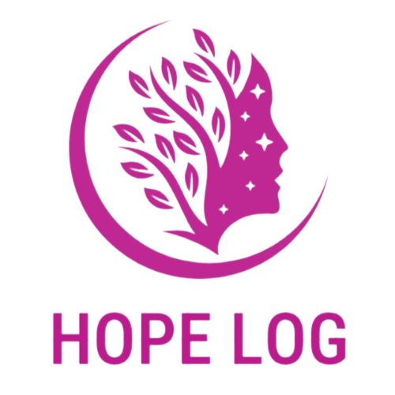

# Hope Log



## About

Hope Log is an advanced AI-powered journaling web application designed to provide users with a conversational mental wellness experience. The platform helps users track emotions, set and monitor goals and habits, and receive AI-generated insights based on their entries.

## Features

### Core Features
- **Conversational Journaling**: Interact with an AI that responds like an empathetic friend, asking questions and maintaining memory of past conversations
- **Journal Entry Management**: Create, view, edit, and delete journal entries with rich content support
- **Mood Tracking**: Record and visualize mood patterns over time
- **Goal Setting & Habit Tracking**: Set, monitor, and achieve personal goals and habits
- **AI-Generated Insights**: Receive personalized insights, weekly summaries, and sentiment analysis of your entries
- **Reminder System**: Get notifications to maintain your journaling practice

### Technical Features
- **RAG Implementation**: Utilizes vector embeddings for context-aware AI responses
- **Sentiment Analysis**: Automatically analyzes the emotional tone of journal entries
- **Subscription Management**: Tiered subscription model with PayPal integration
- **OAuth Authentication**: Secure login with Google account support
- **Responsive Design**: Beautiful user interface that works across devices

## Technology Stack

- **Frontend**: React, TypeScript, Tailwind CSS
- **Backend**: Node.js, Express
- **Database**: PostgreSQL with Drizzle ORM
- **AI Integration**: OpenAI API
- **Authentication**: Passport.js with OAuth support
- **Payment Processing**: PayPal subscription integration

## Installation

1. Clone the repository:
```bash
git clone https://github.com/jazeeljabbar/hopelog-ver2.git
cd hopelog-ver2
```

2. Install dependencies:
```bash
npm install
```

3. Set up environment variables in `.env`:
```
DATABASE_URL=your_postgresql_connection_string
OPENAI_API_KEY=your_openai_api_key
GOOGLE_CLIENT_ID=your_google_client_id
GOOGLE_CLIENT_SECRET=your_google_client_secret
PAYPAL_CLIENT_ID=your_paypal_client_id
PAYPAL_CLIENT_SECRET=your_paypal_client_secret
```

4. Push database schema:
```bash
npm run db:push
```

5. Start the development server:
```bash
npm run dev
```

## Usage

### Journal Entries
- Create new entries through the chat interface or traditional journal editor
- View your entries organized by date
- Get AI-generated insights about your emotional patterns

### Goals & Habits
- Set measurable goals with deadlines
- Track daily habits to build positive routines
- Receive AI-suggested goals based on your journal content

### Account Management
- Configure notification preferences
- Manage subscription tiers
- Update profile settings

## Deployment

The application can be deployed on any Node.js hosting platform that supports PostgreSQL databases.

## Partners & Collaboration

Hope Log collaborates with leading mental health institutions:

- NIMHANS (National Institute of Mental Health and Neurosciences)
- Tata Memorial Hospital
- IIT Hyderabad
- IIIT Hyderabad
- University of Hyderabad

## License

MIT License

## Contact

- Website: [jazeeljabbar.substack.com](https://jazeeljabbar.substack.com/)
- Email: info@hopelog.ai